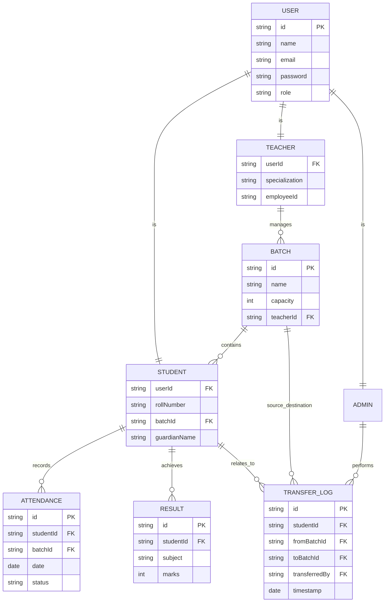

# Entity Relationship Diagram

```mermaid
erDiagram
    USER ||--|| STUDENT : is
    USER ||--|| TEACHER : is
    USER ||--|| ADMIN : is
    
    TEACHER ||--o{ BATCH : manages
    BATCH ||--o{ STUDENT : contains
    
    STUDENT ||--o{ ATTENDANCE : records
    STUDENT ||--o{ RESULT : achieves
    
    ADMIN ||--o{ TRANSFER_LOG : performs
    STUDENT ||--o{ TRANSFER_LOG : relates_to
    BATCH ||--o{ TRANSFER_LOG : source_destination

    USER {
        string id PK
        string name
        string email
        string password
        string role
    }

    STUDENT {
        string userId FK
        string rollNumber
        string batchId FK
        string guardianName
    }

    TEACHER {
        string userId FK
        string specialization
        string employeeId
    }

    BATCH {
        string id PK
        string name
        int capacity
        string teacherId FK
    }

    ATTENDANCE {
        string id PK
        string studentId FK
        string batchId FK
        date date
        string status
    }

    RESULT {
        string id PK
        string studentId FK
        string subject
        int marks
    }

    TRANSFER_LOG {
        string id PK
        string studentId FK
        string fromBatchId FK
        string toBatchId FK
        string transferredBy FK
        date timestamp
    }
```
