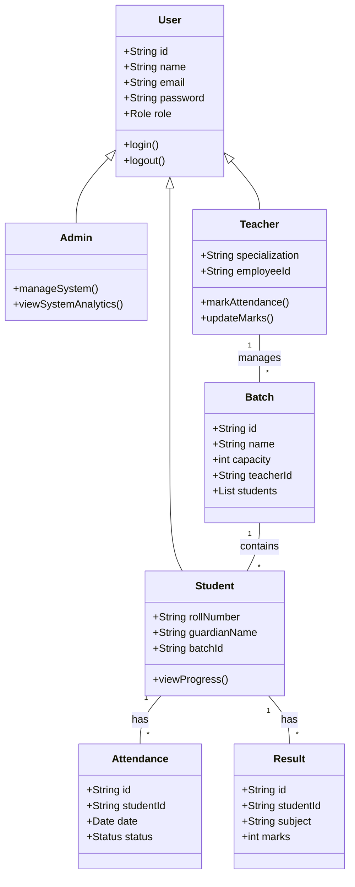

# Class Diagram

```mermaid
classDiagram
    class User {
        +String id
        +String name
        +String email
        +String password
        +Role role
        +login()
        +logout()
    }

    class Admin {
        +manageSystem()
        +viewSystemAnalytics()
    }

    class Teacher {
        +String specialization
        +String employeeId
        +markAttendance()
        +updateMarks()
    }

    class Student {
        +String rollNumber
        +String guardianName
        +String batchId
        +viewProgress()
    }

    User <|-- Admin
    User <|-- Teacher
    User <|-- Student

    class Batch {
        +String id
        +String name
        +int capacity
        +String teacherId
        +List students
    }

    class Attendance {
        +String id
        +String studentId
        +Date date
        +Status status
    }

    class Result {
        +String id
        +String studentId
        +String subject
        +int marks
    }

    Teacher "1" -- "*" Batch : manages
    Batch "1" -- "*" Student : contains
    Student "1" -- "*" Attendance : has
    Student "1" -- "*" Result : has
```
