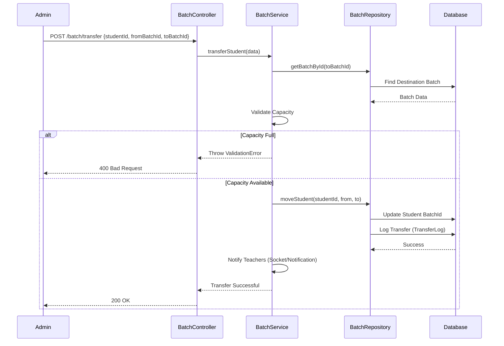

# Sequence Diagram: Batch Hopper Flow

```mermaid
sequenceDiagram
    participant Admin
    participant BatchController
    participant BatchService
    participant BatchRepository
    participant Database

    Admin->>BatchController: POST /batch/transfer {studentId, fromBatchId, toBatchId}
    BatchController->>BatchService: transferStudent(data)
    
    BatchService->>BatchRepository: getBatchById(toBatchId)
    BatchRepository->>Database: Find Destination Batch
    Database-->>BatchRepository: Batch Data
    
    BatchService->>BatchService: Validate Capacity
    
    alt Capacity Full
        BatchService-->>BatchController: Throw ValidationError
        BatchController-->>Admin: 400 Bad Request
    else Capacity Available
        BatchService->>BatchRepository: moveStudent(studentId, from, to)
        BatchRepository->>Database: Update Student BatchId
        BatchRepository->>Database: Log Transfer (TransferLog)
        Database-->>BatchRepository: Success
        
        BatchService->>BatchService: Notify Teachers (Socket/Notification)
        BatchService-->>BatchController: Transfer Successful
        BatchController-->>Admin: 200 OK
    end
```
